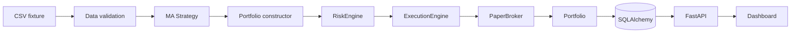

# Architektura

## Kontext a rozhodnutí

První verze je modulární monolit v Pythonu. Je to nejmenší bezpečná varianta pro auditovatelný
vertical slice; doménová logika není ve FastAPI routách a persistence je za repository. SQLite
slouží pro demo/test, SQLAlchemy dovoluje přechod na PostgreSQL bez změny domény.

## Quantitativní konvence

Timestamp daily baru označuje close a je UTC. Adjusted close se používá pro signál, zatímco
raw open pro realizovatelný fill. Signál vypočtený po close T se vyplní nejdříve na open T+1.
Náklady zahrnují fixní a procentní komisi s minimem; bps slippage vždy zhoršuje cenu obchodníka.
Fixture nemá historické universe membership, takže není survivorship-bias-free.

## Selhání a bezpečnost

Kritická datová chyba zastaví běh. ExecutionEngine vlastní jedinou cestu k brokerovi a vždy
volá RiskEngine. Implementován je pouze PaperBroker; žádný live adaptér ani credential path
neexistuje. Allowlist, notional limit a kill switch selhávají uzavřeně.

## Persistence a další komponenty

Run se ukládá jako neměnný JSON snapshot s časem a verzí strategie. Worker, Redis, PostgreSQL,
autentizace, migrace Alembic a plný Next.js frontend patří do dalších fází.
