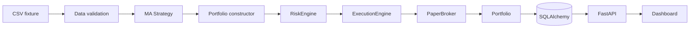

# Architektura

## Kontext a rozhodnutí

První verze je modulární monolit v Pythonu. Je to nejmenší bezpečná varianta pro auditovatelný
vertical slice; doménová logika není ve FastAPI routách a persistence je za repository. SQLite
slouží pro demo/test, SQLAlchemy dovoluje přechod na PostgreSQL bez změny domény.

## Quantitativní konvence

Timestamp daily baru označuje close a je UTC. Adjusted close se používá pro signál, zatímco
raw open pro realizovatelný fill. Signál vypočtený po close T se vyplní nejdříve na open T+1.
Náklady zahrnují fixní a procentní komisi s minimem; bps slippage vždy zhoršuje cenu obchodníka.
Fixture nemá historické universe membership, takže není survivorship-bias-free.

## Selhání a bezpečnost

Kritická datová chyba zastaví běh. ExecutionEngine vlastní jedinou cestu k brokerovi a vždy
volá RiskEngine. Implementován je pouze PaperBroker; žádný live adaptér ani credential path
neexistuje. Allowlist, notional limit a kill switch selhávají uzavřeně.

## Persistence a další komponenty

Run se ukládá jako neměnný JSON snapshot s časem a verzí strategie. Worker, Redis, PostgreSQL,
autentizace, migrace Alembic a plný Next.js frontend patří do dalších fází.

## Research tok a časové invarianty

Tok je `provider → quality events → dataset hash → chronological split → strategy → backtest
→ metrics/benchmark → robustness → eligibility → persistence/report`. Denní timestamp označuje
close v UTC. Strategie obdrží jen prefix končící T; raw open T+1 je nejčasnější fill. Adjusted
close slouží indikátorům a total-return benchmarku. Raw OHLC slouží fillům a raw close ocenění.
Komise i nepříznivá slippage jsou odděleně auditovatelné.

Kritické quality events (duplicita, pořadí, OHLC, nekladné/nečíselné ceny, záporný volume)
zastaví běh. Missing session a cenový skok nad 30 % jsou warningy a nikdy se tiše nemažou.
`USExchangeCalendar` vylučuje víkendy a přijímá explicitní sadu svátků; nejde o tvrzení o úplném
historickém NYSE kalendáři.

Split a walk-forward používají jen pořadí barů. Fold obsahuje disjunktní train, validation a test
hranice; selection smí používat train/validation, nikoli test. Monte Carlo bootstrapuje s
opakováním trade returns a explicitním seedem. Parameter stability přímo reportuje medián,
populační varianci a podíl profitabilních sousedů. Cost stress obsahuje nenulový base model.

Split násobí počet akcií a cash dividend připíše držené množství krát dividend na ex-date.
Adjusted signalová řada se znovu účetně nepřipisuje. Corporate actions musí být dodány explicitně.

## Známá omezení research vrstvy

Fixture nedokládá point-in-time universe ani absenci survivorship bias. Kalendář potřebuje pro
produkční historii úplný seznam mimořádných uzavírek. Bootstrap s malým počtem obchodů je
nestabilní. SQLite je vývojový adapter a research záznamy jsou jednoduché JSON snapshots.
