# Architektura

Autonomous Quant Lab je modulární Python/Next.js platforma pro auditovatelný kvantitativní research a bezpečný automatizovaný **paper trading**. Produkční datový backend je PostgreSQL 17, schema spravuje Alembic a operator UI je Next.js control plane. Projekt neobsahuje live broker ani live execution path.

## Hlavní principy

- všechny interní časy jsou timezone-aware UTC;
- signál z close T se může realizovat nejdříve na raw open následující market session;
- adjusted prices slouží pro signály, raw executable prices pro fills;
- train/validation/OOS jsou chronologické a OOS není použito pro selection;
- market-data evidence a research snapshoty jsou point-in-time a immutable;
- každý ekonomický příkaz prochází `Strategy → Portfolio → RiskEngine → ExecutionEngine → PersistentPaperBroker`;
- HALT, reconciliation a monitoring gates selhávají uzavřeně;
- runtime je PAPER-only.

## Systémový tok

```mermaid
flowchart LR
    MD[Market data provider] --> VAL[Validation + immutable revisions]
    VAL --> PIT[PIT universe + XNYS calendar]
    PIT --> SNAP[Immutable dataset snapshot]
    SNAP --> RES[Research / backtest]
    RES --> REG[Experiment registry]
    REG --> PROM[Explicit PAPER_CANDIDATE promotion]
    PROM --> DEP[Explicit deployment approval]
    DEP --> CUR[Validated current data]
    CUR --> STRAT[Strategy]
    STRAT --> PORT[Portfolio]
    PORT --> RISK[RiskEngine]
    RISK --> EXEC[ExecutionEngine]
    EXEC --> PB[PersistentPaperBroker]
    PB --> REC[Reconciliation]
    REC --> MON[Performance monitoring]
    MON --> API[FastAPI operator/read API]
    API --> UI[Next.js operator dashboard]
```



## Research a data layer

Research pipeline je oddělená od execution runtime:

```text
provider
→ data quality
→ immutable observation revisions
→ XNYS session normalization
→ causally-known corporate actions
→ point-in-time universe
→ immutable content-addressed snapshot
→ strategy / parameter evaluation
→ validation selection
→ exactly-once OOS
→ metrics / robustness / eligibility
→ immutable experiment evidence
```

Phase 6 používá `exchange-calendars` pro autoritativní XNYS schedule. Snapshot pinne konkrétní observation revisions, corporate-action payload a universe membership; provider correction vytvoří novou lineage a nepřepisuje historický replay.

## Research → paper boundary

Research výsledek nemůže začít obchodovat automaticky. Autoritativní workflow je:

```text
COMPLETED / RESEARCH_ONLY experiment
→ explicitní promotion
→ PAPER_CANDIDATE
→ explicitní deployment
→ PENDING_REVIEW
→ explicitní approval
→ APPROVED
→ ACTIVE monitoring enrollment
→ validated current data
→ existující paper execution path
```

Promotion, deployment, approval ani monitoring enrollment nevznikají automaticky. Research snapshot není current execution feed.

## Paper execution a risk

Jediná ekonomická cesta je:

```text
Strategy
→ Portfolio
→ ProductionRiskEngine
→ ExecutionEngine
→ PersistentPaperBroker
→ reconciliation
```

Paper runtime obsahuje persistentní účet, orders/fills, FIFO positions, cash, MARKET/LIMIT order lifecycle, deterministic partial fills, risk decisions, trading cycles, HALT/RESUME a audit evidence.

Risk approval je svázaný s konkrétním order intentem. Broker nesmí přijmout podvržený/stale approval ani obejít persisted `HALTED` stav. Fill accounting a relevantní order/account změny jsou transakční; PostgreSQL row locking a databázové constraints chrání concurrency a quantity invariants.

## Automation runtime

Scheduler přímo neobchoduje. Materializuje persistentní `ScheduledJob`/`JobRun` occurrence s deterministickou identitou. Worker:

1. claimuje due run přes PostgreSQL locking;
2. získá lease a monotónní fencing token;
3. spustí allowlisted paper operation přes existující service boundary;
4. zapisuje attempt/result;
5. používá bounded retry / dead-letter;
6. po restartu pokračuje bezpečně díky persistentnímu stavu a idempotentním Phase 4 identitám.

`AUTOMATION_ENABLED=false` je výchozí stav.

## Monitoring a strategy lifecycle

Schválený paper deployment může být explicitně enrollován do monitoringu. Phase 7 ukládá immutable baseline evidence, daily XNYS performance snapshots a drift evaluations. Lifecycle je:

```text
ACTIVE ↔ PAUSED
ACTIVE/PAUSED → SUSPENDED
ACTIVE/PAUSED/SUSPENDED → RETIRED
```

`RETIRED` je terminal. Soft drift nevytváří automatický retune ani nový experiment/deployment. `SUSPENDED`, `HALTED` nebo unsafe reconciliation blokují execution fail-closed.

## Operator control plane

FastAPI poskytuje backend-authoritative read model a mutation endpoints. Next.js dashboard pouze prezentuje data a volá existující service boundaries; neobsahuje accounting, risk nebo broker logiku.

UI pokrývá:

- paper portfolio a performance;
- strategie a monitoring;
- research a lineage;
- risk a HALT/RESUME;
- XNYS data health;
- automation/operations;
- audit trail.

## Security boundary

Phase 9 přidává:

- bearer autentizaci API;
- VIEWER/OPERATOR/ADMIN RBAC;
- signed expiring dashboard session;
- server-only role credentials;
- CSRF/Origin/Host/CORS ochranu;
- rate limiting;
- actor evidence;
- secret validation/redaction;
- least-privilege PostgreSQL runtime role;
- non-root distroless production images;
- strict dependency/container scanning;
- backup/restore integrity verification.

Browser nikdy nedostává backend bearer credentials. Produkční runtime PostgreSQL role nemá DDL oprávnění; Alembic používá samostatnou migrator credential.

## Databáze a persistence

- PostgreSQL 17 je produkční databáze.
- SQLite slouží pouze jako rychlý test/development adapter tam, kde není potřeba production concurrency proof.
- Alembic je jediná produkční bootstrap/migration cesta.
- Experimenty, snapshots, deployment lineage, risk decisions, paper ledger, automation state, monitoring a audit evidence jsou persistované.
- PostgreSQL advisory locks, row locks, unique constraints a idempotency keys chrání exactly-once / concurrency invarianty podle vrstvy.

## Deployment topology

Production-like Compose používá interní PostgreSQL/backend síť a publikuje pouze frontend boundary. Backend i frontend runtime jsou distroless a non-root. `/healthz` slouží jako liveness a `/readyz` jako DB-aware readiness bez citlivých detailů.

Process-local rate limiter v aktuálním návrhu předpokládá jednu backend repliku. Horizontální škálování by vyžadovalo shared limiter a není součástí Phase 9.

## PAPER-only invariant

Projekt záměrně neobsahuje:

- live broker adapter;
- live credentials;
- live order endpoint;
- live execution feature flag;
- automatickou promotion do live režimu.

Tento invariant je regresně kontrolovaný testy i security auditem.