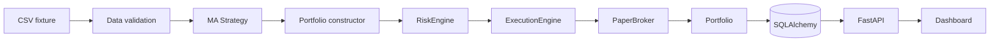

# Architektura

## Kontext a rozhodnutí

První verze je modulární monolit v Pythonu. Je to nejmenší bezpečná varianta pro auditovatelný
vertical slice; doménová logika není ve FastAPI routách a persistence je za repository. SQLite
slouží pro demo/test, SQLAlchemy dovoluje přechod na PostgreSQL bez změny domény.

## Quantitativní konvence

Timestamp daily baru označuje close a je UTC. Adjusted close se používá pro signál, zatímco
raw open pro realizovatelný fill. Signál vypočtený po close T se vyplní nejdříve na open T+1.
Náklady zahrnují fixní a procentní komisi s minimem; bps slippage vždy zhoršuje cenu obchodníka.
Fixture nemá historické universe membership, takže není survivorship-bias-free.

## Selhání a bezpečnost

Kritická datová chyba zastaví běh. ExecutionEngine vlastní jedinou cestu k brokerovi a vždy
volá RiskEngine. Implementován je pouze PaperBroker; žádný live adaptér ani credential path
neexistuje. Allowlist, notional limit a kill switch selhávají uzavřeně.

## Persistence a další komponenty

Run se ukládá jako neměnný JSON snapshot s časem a verzí strategie. PostgreSQL registry a
Alembic migrace jsou implementované v Phase 3; SQLite zůstává testovací adapter. Worker, Redis,
autentizace a plný Next.js frontend patří do dalších fází.

## Research tok a časové invarianty

Tok je `provider → quality events → dataset hash → chronological split → strategy → backtest
→ metrics/benchmark → robustness → eligibility → persistence/report`. Denní timestamp označuje
close v UTC. Strategie obdrží jen prefix končící T; raw open T+1 je nejčasnější fill. Adjusted
close slouží indikátorům a total-return benchmarku. Raw OHLC slouží fillům a raw close ocenění.
Komise i nepříznivá slippage jsou odděleně auditovatelné.

Kritické quality events (duplicita, pořadí, OHLC, nekladné/nečíselné ceny, záporný volume)
zastaví běh. Missing session a cenový skok nad 30 % jsou warningy a nikdy se tiše nemažou.
`USExchangeCalendar` vylučuje víkendy a přijímá explicitní sadu svátků; nejde o tvrzení o úplném
historickém NYSE kalendáři.

Split a walk-forward používají jen pořadí barů. Fold obsahuje disjunktní train, validation a test
hranice; selection smí používat train/validation, nikoli test. Monte Carlo bootstrapuje s
opakováním trade returns a explicitním seedem. Parameter stability přímo reportuje medián,
populační varianci a podíl profitabilních sousedů. Cost stress obsahuje nenulový base model.

Split násobí počet akcií a cash dividend připíše držené množství krát dividend na ex-date.
Adjusted signalová řada se znovu účetně nepřipisuje. Corporate actions musí být dodány explicitně.

## Známá omezení research vrstvy

Fixture nedokládá point-in-time universe ani absenci survivorship bias. Kalendář potřebuje pro
produkční historii úplný seznam mimořádných uzavírek. Bootstrap s malým počtem obchodů je
nestabilní. SQLite je vývojový adapter a research záznamy jsou jednoduché JSON snapshots.

## Phase 2.7 research orchestrace

Autoritativní tok je `provider → quality validation → dataset identity → StrategyFactory →
ParameterSpace → train sweep → validation selection → locked config → exactly-once OOS →
aggregate OOS → FIFO metrics/OOS benchmark → fold-level cost re-backtests → Monte Carlo a
stabilita → eligibility → immutable persistence snapshot/report`. Business tok vlastní
`ResearchExperimentRunner`; FastAPI pouze deleguje aplikační službě. Překryv OOS oken selže.
Train ani validation equity se do agregované research equity nikdy nevkládá.

## Phase 2.8 strukturovaná persistence

SQLite ukládá úplný neměnný JSON snapshot kvůli přesné reprodukci a současně normalizované
hlavičky experimentu, OOS foldy, jejich train/validation ParameterRuny a jednotlivé eligibility
kontroly pro auditní dotazy. ParameterRun ukládá config i jeho hash, stage, status, objective,
metriky, počet uzavřených obchodů a failure reason. OOS evaluace zůstává ve fold/backtest snapshotu,
protože není během výběru parametrů ParameterRunem. Opakovaný zápis stejné identity s odlišným
configem nebo výsledkem selže; nemůže tiše přepsat experiment.
Eligibility check je doménový typ se stavem `passed`, `failed` nebo `not_evaluated`, observed
hodnotou, prahem a důvodem. Odvozená boolean mapa zůstává pouze kompatibilním read-only pohledem.
Experiment, foldy, ParameterRuny a kontroly se materializují v jedné SQLAlchemy session a jednom
commitu; výjimka před commitem ukončí session s rollbackem celé projekce.

## Phase 3 registry a lineage

`DatasetRecord ← ResearchExperiment → StrategyRecord` tvoří kořen lineage. PostgreSQL je produkční
cíl, SQLite testovací adapter a Alembic jediná produkční bootstrap cesta. Experiment chrání
restrict FK; fold, ParameterRun a eligibility check mají explicitní FK a unikátní constraints.
Aggregate OOS metriky jsou explicitní sloupce, úplný snapshot zůstává autoritativní. Registry
neukládá market bary, pouze identitu, rozsah, metadata a storage referenci. Redis a worker nejsou
součástí Phase 3.

## Phase 4 paper runtime

`TradingCycleService` vlastní tok validation → target-vs-actual → `ProductionRiskEngine` → `PersistentPaperBroker` → reconciliation. Broker vyžaduje APPROVED/MODIFIED decision stejného intentu. Cycle, client-order, decision a fill identity chrání DB constraints. Fill, cash, FIFO position, order a audit jsou jedna transakce; divergence persistuje `HALTED`.

Aktivní cycle vlastní časově omezený databázový lease. Souběžný worker vrátí existující cycle,
zatímco restart smí atomicky převzít pouze expirovaný lease. Otevřené ordery vstupují jako pending
množství do target delta i risk exposure. Denní limity se účtují podle execution session cycle,
nikoli podle předchozího decision close.

## Phase 5 automation runtime

API spravuje persistentní `ScheduledJob`, scheduler pouze materializuje deterministický
`JobRun` a nikdy neobchoduje. Samostatný worker claimuje run v PostgreSQL přes
`FOR UPDATE SKIP LOCKED`, přidělí časově omezený lease a monotónní fencing token a teprve poté
volá autoritativní Phase 4 `TradingCycleService` nebo `ReconciliationService`. Retry zachová
scheduled time, snapshot konfigurace a tím i identitu Phase 4 cycle. PostgreSQL unique constraints
chrání occurrence a attempt; account a order locks z Phase 4 serializují ekonomický commit.
SQLite je pouze rychlý test adapter a neposkytuje produkční concurrency důkaz.

## Phase 6
Phase 6 je implementována jako provider → validace/immutable revisions → XNYS calendar/corporate actions → PIT universe → immutable snapshot → multi-asset target portfolio. Detailní invariants jsou v `docs/market-data.md` a `docs/strategy-research.md`. Žádná část nevytváří live execution path; automatický data refresh zatím není allowlistovaný job a refresh se provádí odděleně od trading cycle.

Persistentní Phase 6 služby nyní oddělují immutable research snapshot od mutable validovaného current-data pohledu pro paper runtime. Experiment/deployment schema pinují snapshot lineage, ale kompletní multi-asset evaluation runner a paper integration E2E jsou stále otevřené; architektura proto netvrdí dokončený audit gate.

## Phase 6 runtime boundaries

XNYS session normalizaci poskytuje `XNYSCalendar`; jeho verzovaná identita je součástí snapshot lineage. Auditovaný schedule pokrývá holidays, DST, early closes a podporovaná historická exceptional closures. PostgreSQL advisory transaction locks serializují shodnou ingestion, snapshot a experiment identitu. Immutable manifest pinů konkrétní revisions a actions odděluje replay od pozdějších korekcí. OOS data nevstupují do selection.

Research deployment je ruční evidence gate, nikoli execution engine. Mutable current-data validace vyžaduje poslední dokončenou XNYS session. Schválený deployment smí vstoupit pouze do autoritativní Phase 4 paper cesty; `HALTED` ji zablokuje.
